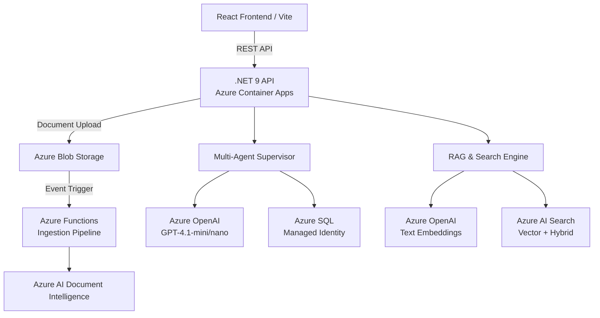

# SessionSight: Enterprise AI Clinical Workflow Architecture

**SessionSight is an Azure-native, production-shaped AI workflow application designed to automate high-volume clinical note extraction and analysis.** It demonstrates how to assemble Azure AI Search, Document Intelligence, Azure OpenAI, and Container Apps into a resilient, enterprise-grade architecture.

By deploying a multi-agent orchestration pattern, SessionSight securely extracts 80+ structured data points from unstructured therapy notes, flags critical patient risks, and enables multi-tool RAG (Retrieval-Augmented Generation) Q&A—drastically reducing manual processing time while enforcing strict architectural boundaries.

> **Note on Data Privacy:** This repository serves as a reference architecture for enterprise cloud deployments. All patient data, clinical notes, and session logs used in this repository are strictly synthetic. No real PHI/PII is included or processed.

## Product Preview
*(Add 3-5 screenshots or a short demo GIF here showing the frontend dashboard, extraction pipeline, and RAG Q&A)*
- `[Screenshot 1: Clinical Dashboard]`
- `[Screenshot 2: AI Extraction Trace]`
- `[Screenshot 3: RAG Q&A Interface]`

## High-Level Architecture



## Enterprise Security & Privacy Boundaries
As a healthcare-adjacent architecture, SessionSight is designed with zero-trust and data compartmentalization principles:
- **Identity-Based Auth:** Zero shared secrets. All internal Azure service-to-service communication uses `DefaultAzureCredential` and Managed Identities.
- **Data Residency:** All AI models run exclusively within isolated Azure OpenAI boundaries; no data is sent to public OpenAI endpoints.
- **Secrets Management:** Environment variables and CI/CD secrets are securely backed by Azure Key Vault.
- **Vulnerability Scanning:** Automated CodeQL and Dependabot pipelines enforce static analysis and dependency security before deployment.

## Skills & Patterns Demonstrated

### AI / LLM Engineering
- **Supervisor pattern** — orchestrator agent routes to specialized sub-agents
- **Multi-agent pipeline** — Intake → ClinicalExtractor → RiskAssessor → Summarizer → Embedding
- **Agent-to-tool callbacks** — agents dynamically call tools, reason about results, and iterate (agentic loop)
- **Tool use / function calling** — `IAgentTool` implementations with structured input/output
- **Model routing** — GPT-4.1-mini for complex tasks, GPT-4.1-nano for simple ones (cost optimization)
- **Prompt engineering** — structured prompts per agent with temperature tuning (0.0–0.3)
- **Structured output** — JSON mode enforcing an 82-field clinical schema
- **Confidence scoring & source mapping** — `ExtractedField<T>` with Value, Confidence, Source
- **Dual-path Q&A routing** — simple questions → single-shot RAG, complex → agentic loop

### RAG & Search
- **Retrieval-Augmented Generation** — Q&A agent grounded in patient session data
- **Vector search** — text-embedding-3-large embeddings indexed in Azure AI Search
- **Hybrid search** — combined vector + keyword search for better recall
- **Multi-tool search strategy** — SearchSessions, GetSessionDetail, GetPatientTimeline, AggregateMetrics

### Cloud (Azure)
- **Azure OpenAI** — GPT-4.1-mini, GPT-4.1-nano, text-embedding-3-large
- **Azure AI Search** — vector index + hybrid queries
- **Azure SQL** — with Managed Identity auth (no passwords)
- **Azure Blob Storage** — document upload and processing
- **Azure Container Apps** — scale-to-zero serverless deployment
- **Azure Key Vault** — secrets management
- **Azure AI Document Intelligence** — OCR / PDF parsing
- **Azure Functions** — blob trigger ingestion pipeline
- **DefaultAzureCredential** — unified identity-based auth across all services

### DevOps / CI/CD / IaC
- **GitHub Actions** — multi-job CI/CD pipelines with parallel stages
- **Infrastructure as Code** — hand-written Bicep (not auto-generated)
- **Automated back-merge** — main → develop via workflow after each release
- **Code coverage gates** — 83% local / 80% CI enforced thresholds
- **SonarCloud** — static analysis with local parity via analyzers
- **CodeQL** — automated security scanning
- **Dependabot** — NuGet, npm, and GitHub Actions dependency updates
- **PR-based workflow** — branch protection, squash-merge for features, merge-commit for releases

### Containerization & Orchestration
- **.NET Aspire 9.x** — cloud-native service orchestration with local dev dashboard
- **Docker** — containerized SQL, storage emulator, and application services
- **Azure Container Apps** — auto-scaling with cooldown policies and rollback support
- **Environment management** — dev / stage promotion with Bicep parameters

### Resilience & Reliability
- **Circuit breaker** — custom state machine (Closed → Open → HalfOpen), thread-safe sliding-window failure counting
- **Retry with exponential backoff + jitter** — custom policies for both Azure SDK families
- **Optimistic concurrency** — RowVersion on entities, atomic status transitions via `WHERE` clause
- **Idempotency** — SHA256-based deterministic keys for blob trigger deduplication
- **Health checks** — liveness + readiness probes for container orchestration
- **Graceful degradation** — search index init failures logged but don't block startup

### Async & Event-Driven Patterns
- **202 Accepted + polling** — long-running extraction with frontend polling via TanStack Query
- **Producer-consumer queue** — `System.Threading.Channels` bounded queue with 3 concurrent workers
- **BackgroundService** — hosted service for extraction job dispatch with graceful shutdown
- **Event-driven ingestion** — Azure Functions blob trigger with container promotion (incoming → processing → processed)

### Backend Architecture
- **.NET 9 / C# 13** — latest platform features
- **ASP.NET Core REST API** — with OpenAPI + Scalar API docs
- **Clean architecture** — Core, Infrastructure, API, Agents layers
- **EF Core 9** — code-first migrations (13 migrations) with Azure SQL
- **FluentValidation** — auto-discovered validators from assembly scanning
- **Repository pattern + dependency injection** — testable, decoupled design
- **OpenTelemetry** — distributed tracing and observability
- **Structured logging** — Serilog with CorrelationId middleware, custom log levels per HTTP status
- **Schema generation via reflection** — C# types → JSON schema for LLM prompts
- **Request/response logging middleware** — toggleable body capture with content-type filtering

### Frontend
- **React + TypeScript** — component-based UI with Vite
- **TanStack Query v5** — server-state management with cache invalidation (no Redux)
- **Tailwind CSS v4** — responsive design with mobile/desktop breakpoints
- **Accessibility** — aria-expanded, htmlFor/id pairing, aria-hidden on decorative elements
- **Processing log visualization** — pipeline steps, LLM traces, activity views
- **Playwright E2E** — full-stack browser automation tests

### Testing Strategy
- **Multi-tier testing** — unit, integration, functional E2E, and load tests
- **Golden file testing** — LLM output validation against baselines
- **Playwright E2E** — full-stack browser automation with screenshot capture
- **k6 load testing** — concurrent user simulation with rate-limit handling
- **MSW (Mock Service Worker)** — API mocking for isolated frontend tests
- **83% code coverage** — enforced locally and in CI

### AI-Assisted Development
- **Built with Claude Code** — AI as development partner from architecture through deployment
- **Markdown-based planning** — structured backlog, phase specs, research docs, ADRs
- **Phase-based methodology** — 7 phases from foundation to production deployment

## Tech Stack

| Layer | Technology |
|-------|------------|
| Orchestration | .NET Aspire 9.x |
| Backend | .NET 9, C# 13, ASP.NET Core |
| Frontend | React, TypeScript, Vite |
| AI / LLM | Azure OpenAI (GPT-4.1-mini, GPT-4.1-nano) |
| Embeddings | Azure OpenAI (text-embedding-3-large) |
| Search | Azure AI Search (vector + hybrid) |
| Database | Azure SQL (EF Core 9, Managed Identity) |
| Storage | Azure Blob Storage |
| OCR | Azure AI Document Intelligence |
| Deployment | Azure Container Apps, GitHub Actions, Bicep IaC |
| Testing | xUnit, Vitest, Playwright, k6, MSW |
| Observability | OpenTelemetry, Application Insights |

## Prerequisites

- [.NET 9 SDK](https://dotnet.microsoft.com/download/dotnet/9.0)
- [Docker Desktop](https://www.docker.com/products/docker-desktop/) (for Aspire local containers)
- Azure CLI (`az login` for DefaultAzureCredential)

## Build

```bash
dotnet build session-sight.sln
```

## Test

```bash
dotnet test session-sight.sln
```

With coverage:

```bash
dotnet test session-sight.sln --collect:"XPlat Code Coverage"
dotnet tool restore
dotnet reportgenerator -reports:"**/coverage.cobertura.xml" -targetdir:coverage -reporttypes:Html
```

## Run (Aspire)

```bash
dotnet run --project src/SessionSight.AppHost
```

Opens the Aspire dashboard with the API, SQL Server, and Blob Storage emulator.

### Local Development Notes

See [docs/LOCAL_DEV.md](docs/LOCAL_DEV.md) for comprehensive local development documentation including:
- First-time setup (secrets, Azure CLI, endpoints)
- API endpoint: https://localhost:7039 (fixed port)
- Running migrations manually
- Troubleshooting common issues

Quick start:

```bash
# Set SQL password (first time only)
cd src/SessionSight.AppHost
dotnet user-secrets set "Parameters:sql-password" "LocalDev#2026!"

# Start Aspire (ensure az is in PATH)
dotnet run
```

## Project Structure

```
src/
  SessionSight.Core/             Domain models, enums, schema, interfaces
  SessionSight.Infrastructure/   EF Core, repositories, blob storage
  SessionSight.Api/              REST API (11 endpoints), middleware
  SessionSight.Agents/           AI agents (extraction pipeline)
  SessionSight.BlobTrigger/      Azure Function for blob ingestion
  SessionSight.AppHost/          Aspire orchestration
  SessionSight.ServiceDefaults/  OpenTelemetry, health checks, resilience
tests/
  SessionSight.Core.Tests/       Domain model + schema tests (59 tests)
  SessionSight.Api.Tests/        Controller, validator tests (46 tests)
  SessionSight.Agents.Tests/     Agent routing + service tests (87 tests)
  SessionSight.FunctionalTests/  E2E tests with Aspire (5 tests)
scripts/
  run-e2e.sh                     Automated E2E test runner
  start-aspire.sh                Manual Aspire startup
```

## API Endpoints

| Method | Endpoint | Description |
|--------|----------|-------------|
| GET | `/api/patients` | List all patients |
| GET | `/api/patients/{id}` | Get patient by ID |
| POST | `/api/patients` | Create patient |
| PUT | `/api/patients/{id}` | Update patient |
| DELETE | `/api/patients/{id}` | Delete patient |
| GET | `/api/patients/{id}/sessions` | List patient sessions |
| GET | `/api/sessions/{id}` | Get session by ID |
| POST | `/api/sessions` | Create session |
| PUT | `/api/sessions/{id}` | Update session |
| POST | `/api/sessions/{id}/document` | Upload session document |
| GET | `/api/sessions/{id}/extraction` | Get extraction result |

## Architecture Docs

See `plan/docs/` for full architecture documentation including:
- [Project Plan](plan/docs/PROJECT_PLAN.md)
- [Clinical Schema](plan/docs/specs/clinical-schema.md) (82 fields, 27 enums)
- [Phase Specs](plan/docs/specs/)
- [ADRs](plan/docs/decisions/)

## License

[MIT](LICENSE)
