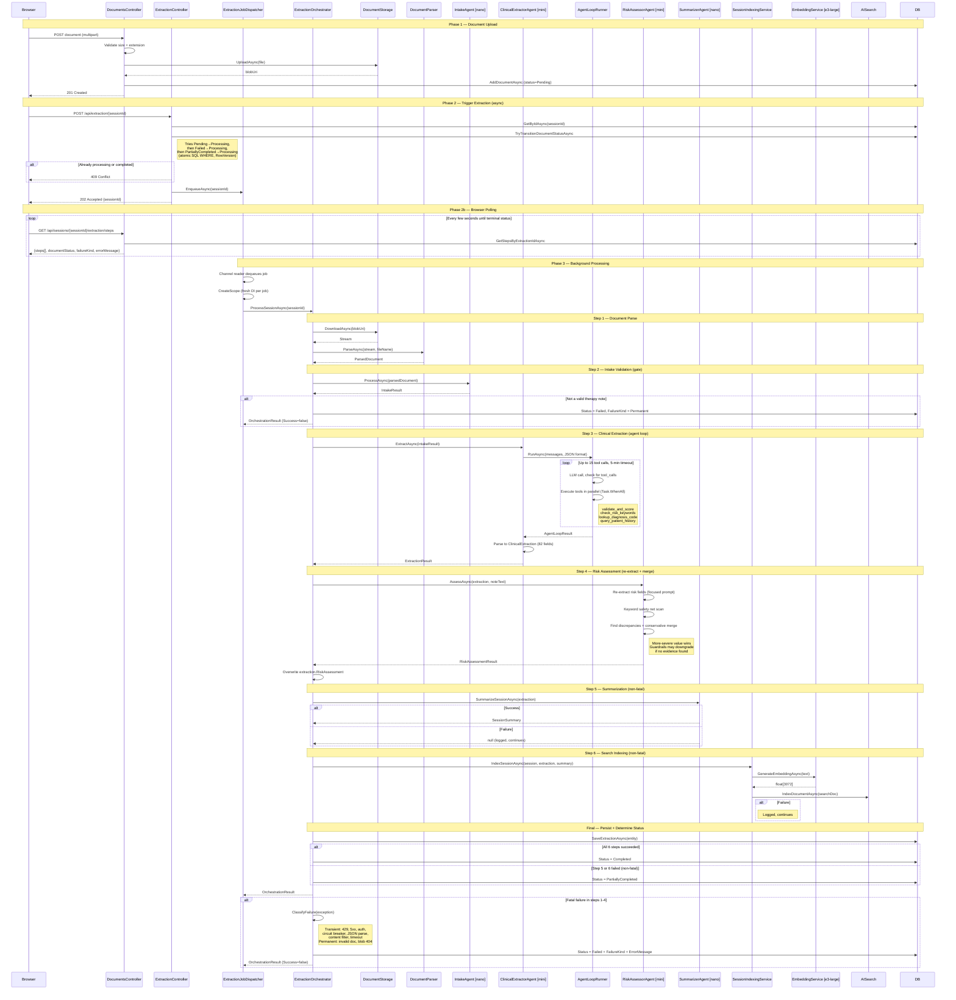
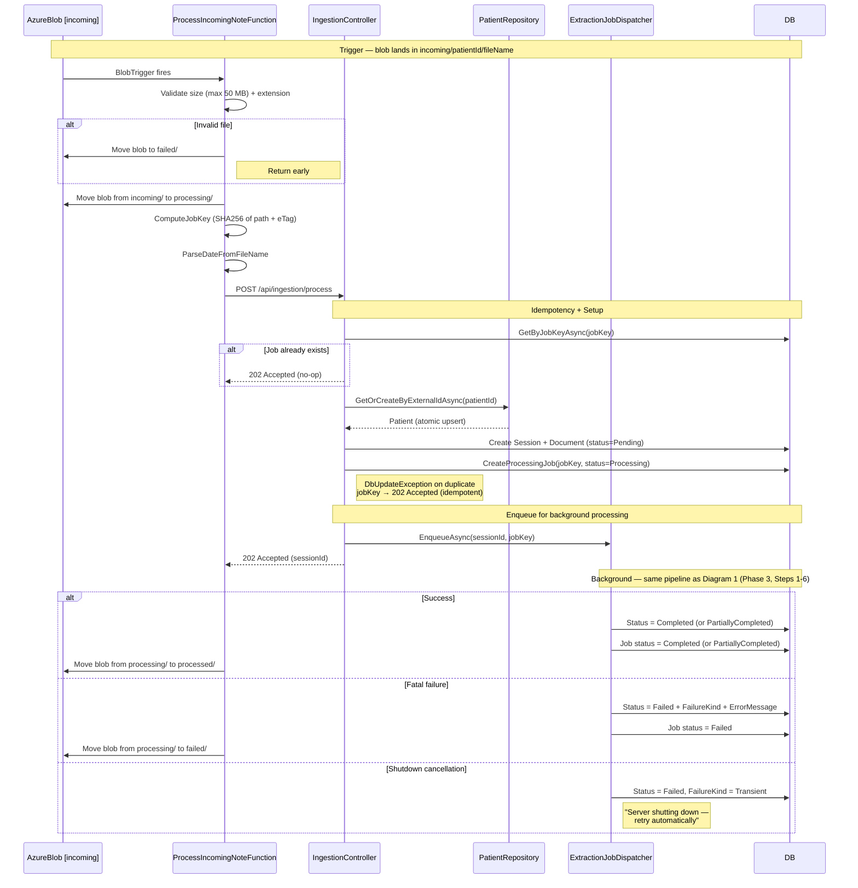
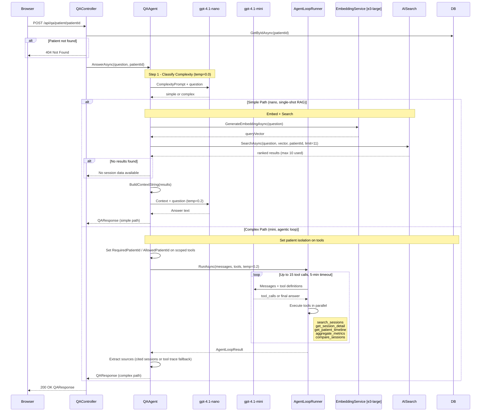
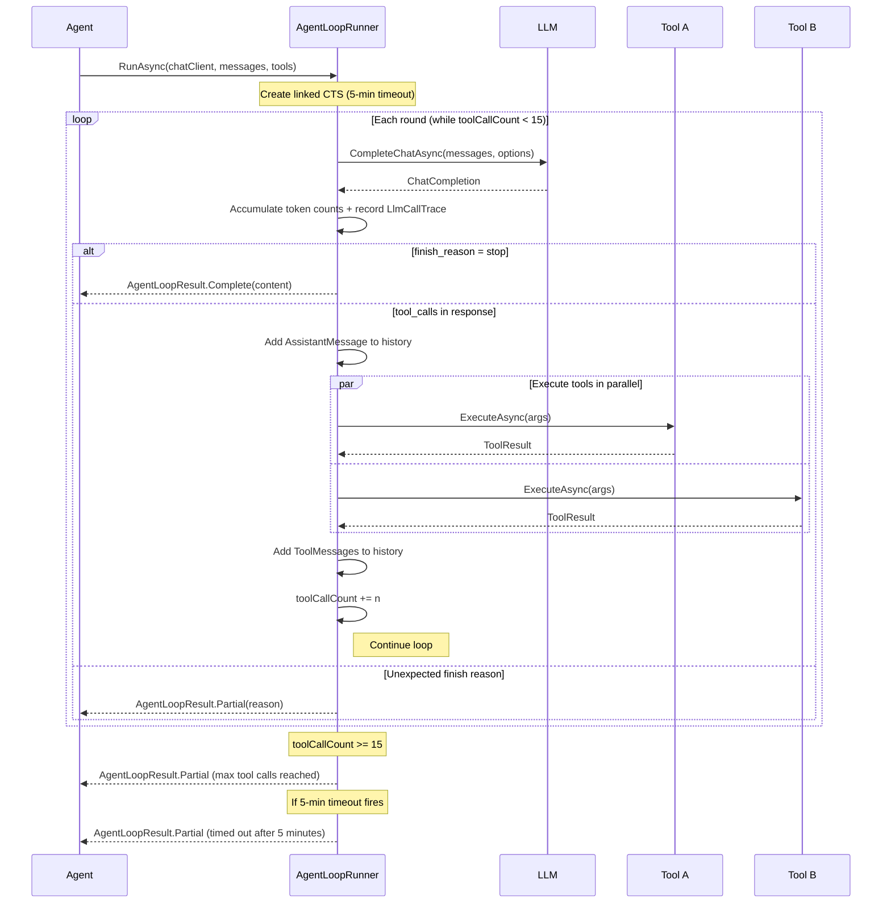
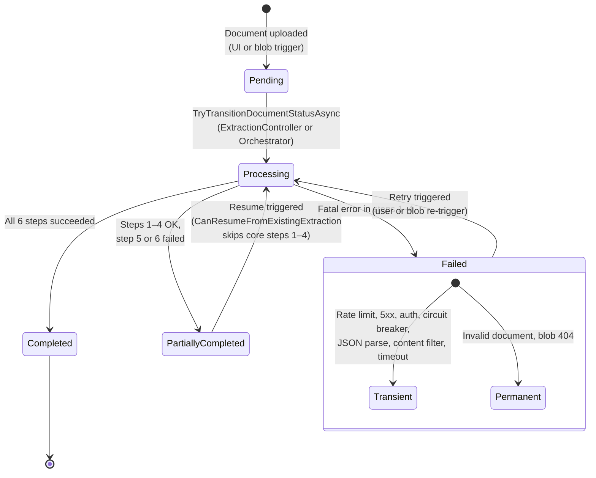
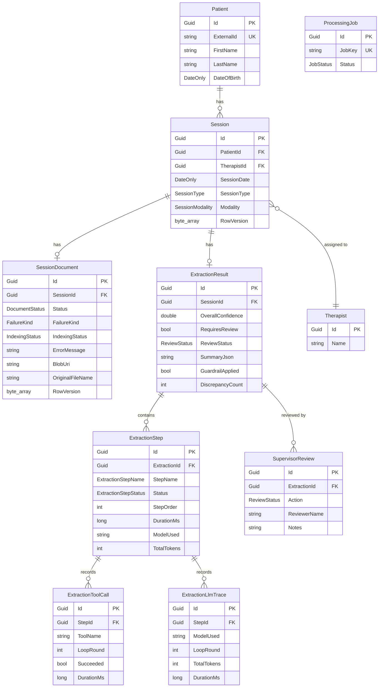

# SessionSight Architecture

SessionSight is a clinical note analysis platform that uses an AI agent pipeline to extract structured data from therapy session notes. Documents enter via UI upload or Azure Blob trigger, pass through intake validation, clinical extraction (82 fields), risk assessment, summarization, and search indexing before results are persisted.

## System Overview

### Model Assignments

| Task | Model | Temperature |
|------|-------|-------------|
| Document Intake | gpt-4.1-nano | 0.1 |
| Clinical Extraction | gpt-4.1-mini | 0.1 |
| Risk Assessment | gpt-4.1-mini | 0.1 |
| Summarization | gpt-4.1-nano | 0.3 |
| Q&A Complexity Classifier | gpt-4.1-nano | 0.0 |
| Q&A Simple | gpt-4.1-nano | 0.2 |
| Q&A Complex | gpt-4.1-mini | 0.2 |
| Embeddings | text-embedding-3-large | - |

### Pipeline Summary

Document &rarr; IntakeAgent (gate) &rarr; ClinicalExtractorAgent (82 fields via tool loop) &rarr; RiskAssessorAgent (re-extract + conservative merge) &rarr; SummarizerAgent &rarr; SessionIndexingService &rarr; Database

Extraction is triggered asynchronously via `ExtractionJobDispatcher` (bounded channel, 3 concurrent workers). Steps 1&ndash;4 are fatal; steps 5&ndash;6 are non-fatal (failures yield `PartiallyCompleted` status with automatic resume on retry).

---

## Sequence Diagrams

### 1. Extraction Pipeline (UI Upload)

A user uploads a document through the browser, then triggers extraction. The controller enqueues the job on the `ExtractionJobDispatcher` and returns `202 Accepted` immediately. The browser polls for step-level progress while the orchestrator runs six sequential steps in the background, two of which are non-fatal (summarization and search indexing).

The `ExtractionController` atomically transitions the document status from `Pending`, `Failed`, or `PartiallyCompleted` to `Processing` via `TryTransitionDocumentStatusAsync` (SQL `WHERE Status = @expected` with `RowVersion` concurrency). If the transition succeeds, it enqueues the session ID on the `ExtractionJobDispatcher` and returns `202 Accepted`. The browser then polls `GET /api/sessions/{sessionId}/extraction/steps` for step-level progress, document status, failure kind, and error message.

The `ExtractionJobDispatcher` is a `BackgroundService` that reads from a bounded `Channel<ExtractionJob>` (capacity 20) with up to 3 concurrent workers. Each worker creates a fresh DI scope via `IServiceScopeFactory`, resolves the orchestrator, and calls `ProcessSessionAsync`. On fatal failure (steps 1&ndash;4), the orchestrator calls `ClassifyFailure` to categorize the exception as `Transient` (rate limit, 5xx, credential, circuit breaker, JSON parse, content filter, timeout) or `Permanent` (invalid document, blob not found) and persists the `FailureKind` and `ErrorMessage` on the document. On non-fatal failure (steps 5&ndash;6: summarization or search indexing), the document transitions to `PartiallyCompleted`. A subsequent extraction trigger for a `PartiallyCompleted` document resumes from the first failed non-fatal step via `CanResumeFromExistingExtraction`, skipping the already-succeeded core steps (1&ndash;4).

### 2. Extraction Pipeline (Blob Trigger)

The asynchronous ingestion path: an Azure Function watches the `incoming/` container. When a blob lands, it moves through `processing/` and `processed/` (or `failed/`) containers while the `ExtractionJobDispatcher` runs the same orchestrator pipeline in the background.

The `GetOrCreateByExternalIdAsync` call uses a catch-and-retry pattern on unique constraint violation to handle concurrent blob triggers for the same patient. Instead of `Task.Run` with manual scope creation, the `IngestionController` enqueues the job on the `ExtractionJobDispatcher` via `EnqueueAsync(sessionId, jobKey)`. The dispatcher's bounded channel (capacity 20, 3 concurrent workers) processes the extraction in a fresh DI scope. After the orchestrator completes, the dispatcher checks the `JobKey` and updates the `ProcessingJob` status to `Completed`, `PartiallyCompleted`, or `Failed`. On shutdown cancellation, the dispatcher marks the document as `Failed` with `FailureKind.Transient` and the message "Server shutting down &mdash; retry automatically" using a non-cancellable token (best effort).

### 3. Q&A Dual-Path Flow

The Q&A system classifies each question as simple or complex, then routes to the appropriate path. Simple questions use single-shot RAG with vector search. Complex questions use an agentic loop with five specialized tools.

Patient isolation is enforced at the tool level: `search_sessions`, `get_session_detail`, and `compare_sessions` have a `RequiredPatientId`/`AllowedPatientId` property set before the loop starts, ensuring the LLM cannot access data from other patients regardless of the arguments it generates.

### 4. Agent Loop Runner

The `AgentLoopRunner` is the shared execution engine used by both the extraction agent and the complex Q&A path. It manages the LLM &harr; tool call loop with guards against runaway execution.

Two overloads serve different use cases:
- **DI-injected tools** (extraction): `RunAsync(chatClient, messages, responseFormat, temperature, ct)` uses tools registered in the DI container (validate_and_score, check_risk_keywords, lookup_diagnosis_code, query_patient_history).
- **Explicit tool list** (Q&A): `RunAsync(chatClient, messages, tools, temperature, ct)` accepts an `IEnumerable<IAgentTool>` for the five Q&A tools with patient-scoped access.

Unknown tool names return `ToolResult.Error()` rather than throwing, allowing the LLM to self-correct in subsequent rounds. Partial results (from timeout or max tool calls) are surfaced to the caller, which can decide whether to return them to the user or flag for review.

---

## Data Flow Diagrams

### 5. Document Lifecycle

The `SessionDocument.Status` state machine governs the entire extraction pipeline. All transitions use `TryTransitionDocumentStatusAsync` with an atomic `UPDATE ... WHERE Status = @expected` and `RowVersion` optimistic concurrency.

A `SessionDocument` progresses through five statuses. The `Failed` state carries a `FailureKind` (`Transient` or `Permanent`) and a user-facing `ErrorMessage`. Transient failures (rate limits, service outages, authentication errors, content filter, timeouts) are retryable. Permanent failures (invalid document, missing blob) require manual intervention. The `PartiallyCompleted` state indicates that core extraction succeeded (steps 1&ndash;4) but one or more non-fatal steps (summarization, search indexing) failed. Resuming from `PartiallyCompleted` calls `CanResumeFromExistingExtraction`, which checks that all four core steps have `Succeeded` status, then runs only the failed non-fatal steps.

### 6. Data Transformation Pipeline

How raw document bytes become structured clinical data, search vectors, and database entities across the six pipeline steps.

```mermaid
flowchart LR
    subgraph Input
        PDF["PDF / DOCX / Image"]
    end

    subgraph Step1["Step 1 · Document Parse"]
        DocIntel["Azure Document<br/>Intelligence"]
        Parsed["ParsedDocument<br/>MarkdownContent +<br/>PageCount + OcrConfidence"]
    end

    subgraph Step2["Step 2 · Intake"]
        IntakeAg["IntakeAgent<br/>gpt-4.1-nano"]
        IR["IntakeResult<br/>isValid · docType ·<br/>sessionDate · language"]
    end

    subgraph Step3["Step 3 · Clinical Extraction"]
        ExtAg["ClinicalExtractorAgent<br/>gpt-4.1-mini"]
        Loop["AgentLoopRunner<br/>≤15 tool calls"]
        ER["ClinicalExtraction<br/>82 fields as<br/>ExtractedField‹T›<br/>Value + Confidence + Source"]
    end

    subgraph Step4["Step 4 · Risk Assessment"]
        RiskAg["RiskAssessorAgent<br/>gpt-4.1-mini"]
        Merge["Conservative Merge<br/>+ Keyword Safety Net"]
        RA["RiskAssessmentResult<br/>riskLevel · discrepancies ·<br/>guardrail decisions"]
    end

    subgraph Step5["Step 5 · Summarization"]
        SumAg["SummarizerAgent<br/>gpt-4.1-nano"]
        SS["SessionSummary<br/>oneLiner ·<br/>interventionsUsed"]
    end

    subgraph Step6["Step 6 · Search Indexing"]
        EmbSvc["EmbeddingService<br/>text-embedding-3-large"]
        Vec["float 3072"]
        SearchDoc["SearchDocument<br/>text + vector + metadata"]
    end

    subgraph Persist["Database"]
        ExtRes["ExtractionResult<br/>+ ExtractionSteps<br/>+ SummaryJson"]
        DocStatus["SessionDocument<br/>Status + FailureKind"]
        SearchIdx["Azure AI Search<br/>Index"]
    end

    PDF --> DocIntel --> Parsed
    Parsed --> IntakeAg --> IR
    IR --> ExtAg --> Loop --> ER
    ER --> RiskAg --> Merge --> RA
    RA --> SumAg --> SS
    RA --> EmbSvc --> Vec --> SearchDoc

    ER --> ExtRes
    RA --> ExtRes
    SS --> ExtRes
    SearchDoc --> SearchIdx
    ExtRes --> DocStatus
```

Raw document bytes enter the pipeline and undergo six transformations. Steps 1&ndash;4 are fatal: a failure at any point halts the pipeline and classifies the failure. Steps 5&ndash;6 are non-fatal: failures result in `PartiallyCompleted` status. Each step records its progress as an `ExtractionStep` entity with status, timing, model used, token counts, and optional LLM traces. The `ClinicalExtraction` schema contains 82 fields, each wrapped in `ExtractedField<T>` with `Value`, `Confidence` (0&ndash;1), and `Source` (quoted text from the note). The risk assessment stage re-extracts risk-specific fields with a focused prompt, runs a keyword safety net scan, then conservatively merges results (more-severe value wins). The final `ExtractionResult` entity aggregates extraction data, summary JSON, risk audit columns, and per-field risk decisions.

### 7. Entity Relationship

Core domain entities and their relationships. Navigation properties shown as relationship lines; key columns listed inside each entity.

A `Patient` has many `Sessions`. Each `Session` has at most one `SessionDocument` (the uploaded file) and at most one `ExtractionResult` (the structured extraction output). An `ExtractionResult` contains up to six `ExtractionStep` records, one per pipeline stage. Each step may have `ExtractionToolCall` records (for the agent loop's tool invocations) and `ExtractionLlmTrace` records (raw LLM request/response pairs, gated by `PipelineDiagnosticsOptions.StoreLlmTraces`). `SupervisorReview` captures human review decisions on flagged extractions. `ProcessingJob` tracks blob-triggered ingestion jobs by `JobKey` (SHA256 of blob path + eTag) for idempotency &mdash; it is not linked to `Session` by foreign key but is correlated by the `ExtractionJobDispatcher` at runtime. Both `Session` and `SessionDocument` use `RowVersion` for optimistic concurrency.
