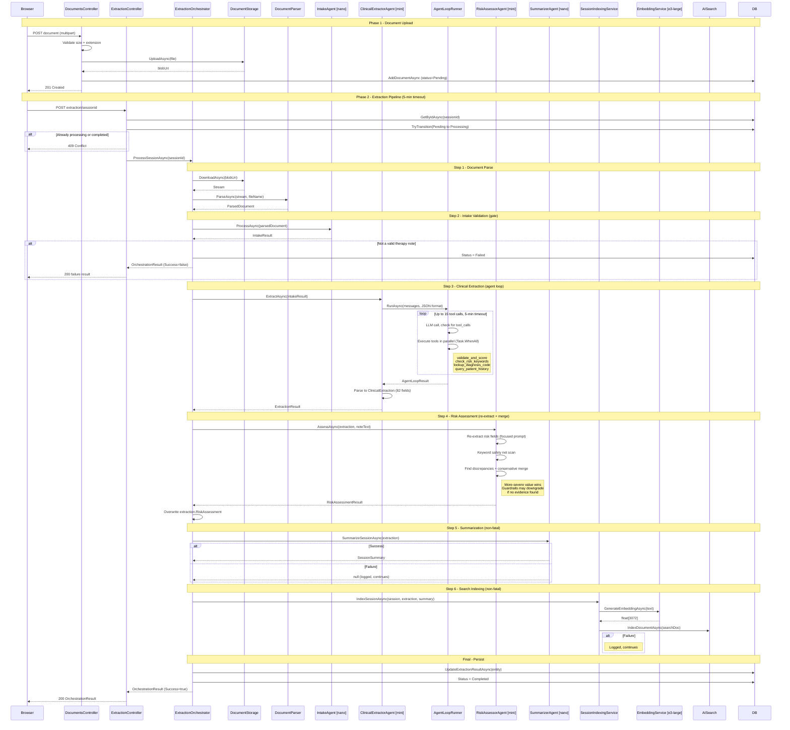
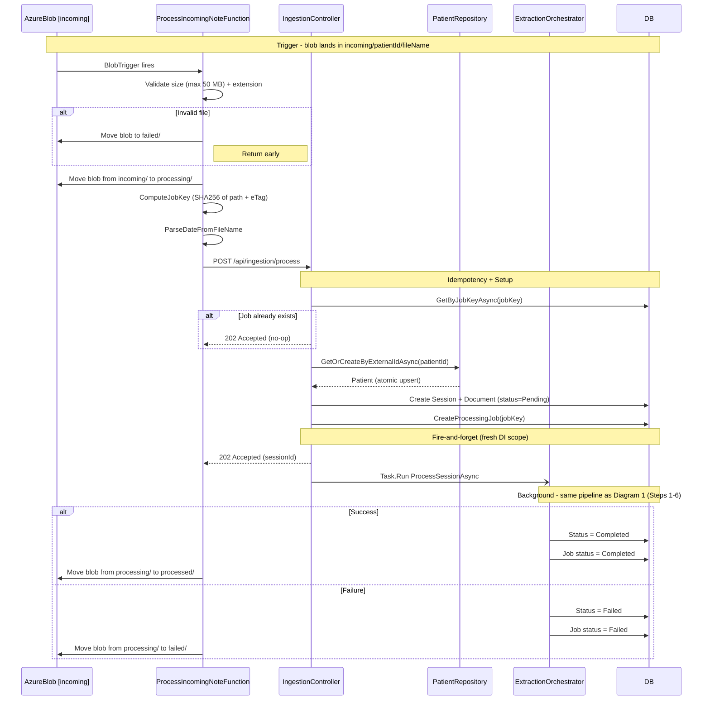
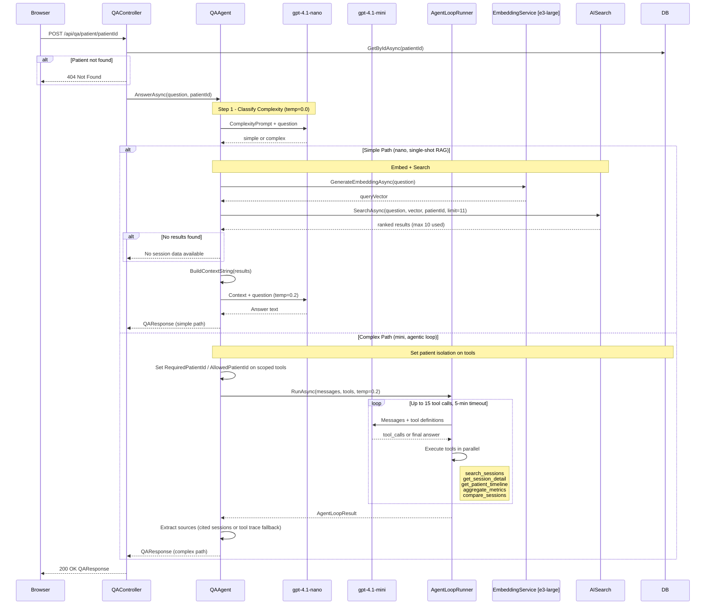
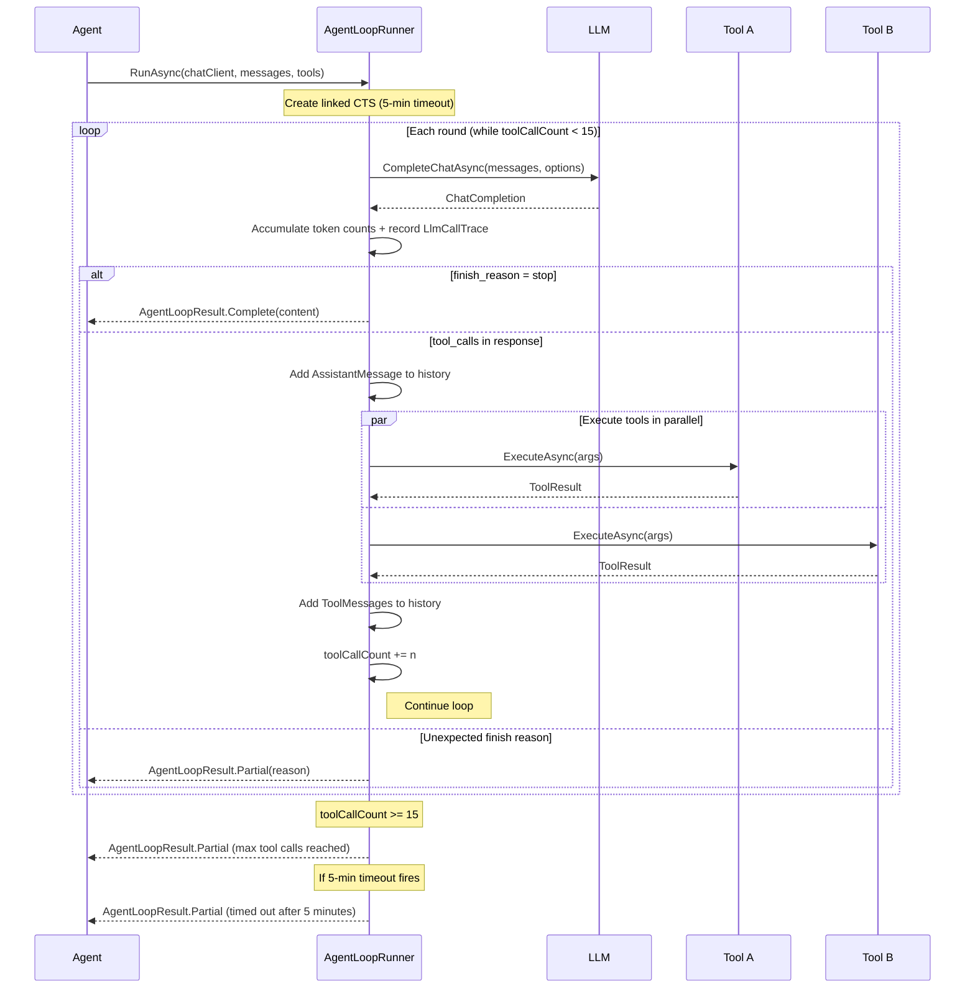

# SessionSight Architecture

SessionSight is a clinical note analysis platform that uses an AI agent pipeline to extract structured data from therapy session notes. Documents enter via UI upload or Azure Blob trigger, pass through intake validation, clinical extraction (82 fields), risk assessment, summarization, and search indexing before results are persisted.

## System Overview

### Model Assignments

| Task | Model | Temperature |
|------|-------|-------------|
| Document Intake | gpt-4.1-nano | 0.1 |
| Clinical Extraction | gpt-4.1-mini | 0.1 |
| Risk Assessment | gpt-4.1-mini | 0.1 |
| Summarization | gpt-4.1-nano | 0.3 |
| Q&A Complexity Classifier | gpt-4.1-nano | 0.0 |
| Q&A Simple | gpt-4.1-nano | 0.2 |
| Q&A Complex | gpt-4.1-mini | 0.2 |
| Embeddings | text-embedding-3-large | - |

### Pipeline Summary

Document &rarr; IntakeAgent (gate) &rarr; ClinicalExtractorAgent (82 fields via tool loop) &rarr; RiskAssessorAgent (re-extract + conservative merge) &rarr; SummarizerAgent &rarr; SessionIndexingService &rarr; Database

---

## Sequence Diagrams

### 1. Extraction Pipeline (UI Upload)

The synchronous path: a user uploads a document through the browser, then triggers extraction. The orchestrator runs six sequential steps, two of which are non-fatal (summarization and search indexing).

The ExtractionController creates its own 5-minute `CancellationTokenSource`, decoupled from the HTTP request cancellation. This means the pipeline runs to completion even if the browser disconnects. On any unhandled exception, the orchestrator transitions the document status to Failed.

### 2. Extraction Pipeline (Blob Trigger)

The asynchronous ingestion path: an Azure Function watches the `incoming/` container. When a blob lands, it moves through `processing/` and `processed/` (or `failed/`) containers while the same orchestrator runs in the background.

The `GetOrCreateByExternalIdAsync` call uses a catch-and-retry pattern on unique constraint violation to handle concurrent blob triggers for the same patient. The `Task.Run` uses `IServiceScopeFactory` to create a fresh DI scope, ensuring the background work has its own DbContext and doesn't conflict with the HTTP request lifecycle.

### 3. Q&A Dual-Path Flow

The Q&A system classifies each question as simple or complex, then routes to the appropriate path. Simple questions use single-shot RAG with vector search. Complex questions use an agentic loop with five specialized tools.

Patient isolation is enforced at the tool level: `search_sessions`, `get_session_detail`, and `compare_sessions` have a `RequiredPatientId`/`AllowedPatientId` property set before the loop starts, ensuring the LLM cannot access data from other patients regardless of the arguments it generates.

### 4. Agent Loop Runner

The `AgentLoopRunner` is the shared execution engine used by both the extraction agent and the complex Q&A path. It manages the LLM &harr; tool call loop with guards against runaway execution.

Two overloads serve different use cases:
- **DI-injected tools** (extraction): `RunAsync(chatClient, messages, responseFormat, temperature, ct)` uses tools registered in the DI container (validate_and_score, check_risk_keywords, lookup_diagnosis_code, query_patient_history).
- **Explicit tool list** (Q&A): `RunAsync(chatClient, messages, tools, temperature, ct)` accepts an `IEnumerable<IAgentTool>` for the five Q&A tools with patient-scoped access.

Unknown tool names return `ToolResult.Error()` rather than throwing, allowing the LLM to self-correct in subsequent rounds. Partial results (from timeout or max tool calls) are surfaced to the caller, which can decide whether to return them to the user or flag for review.
